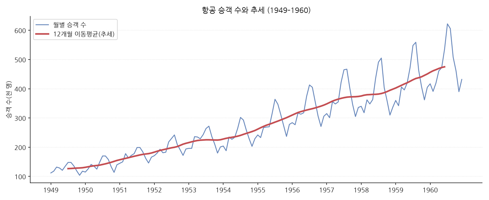
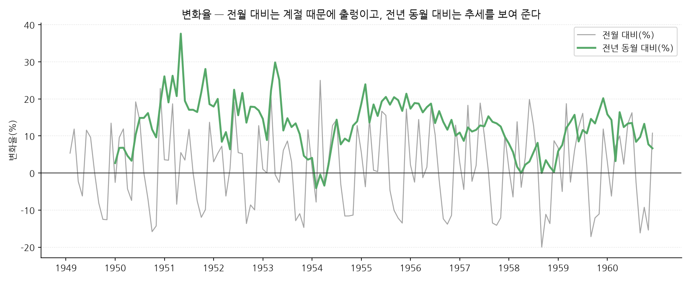
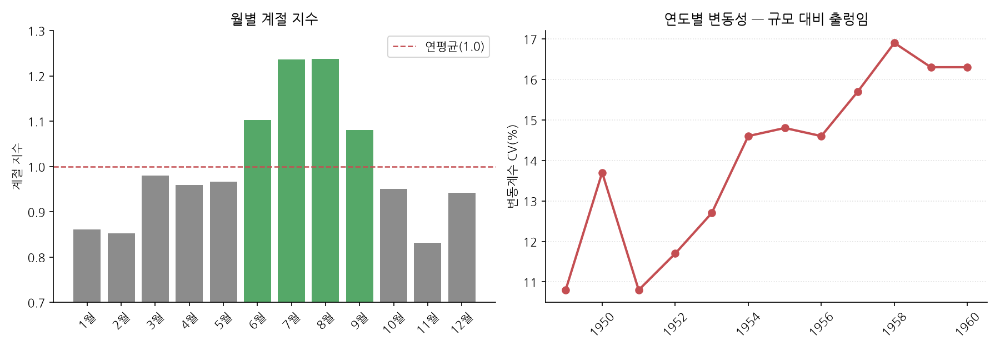
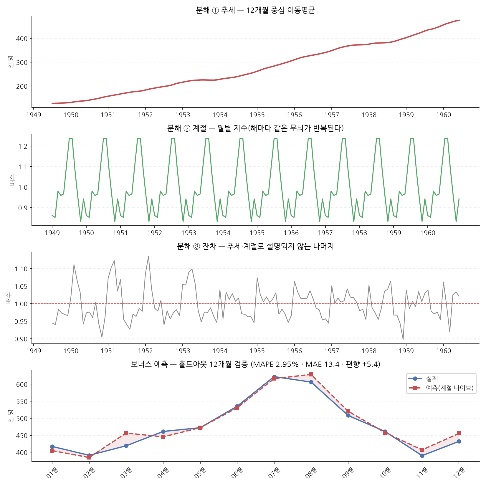
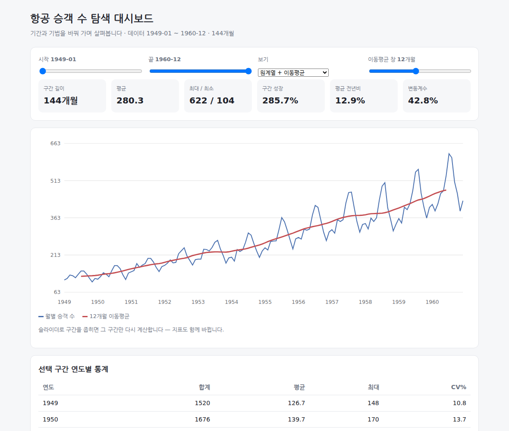
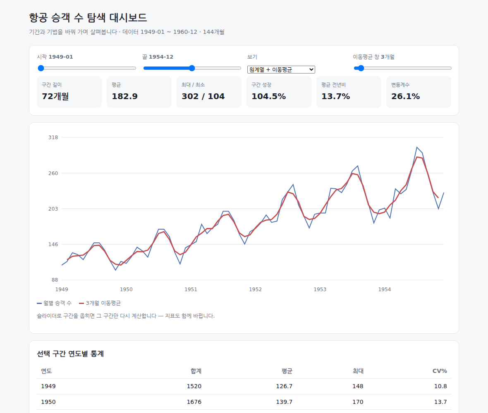
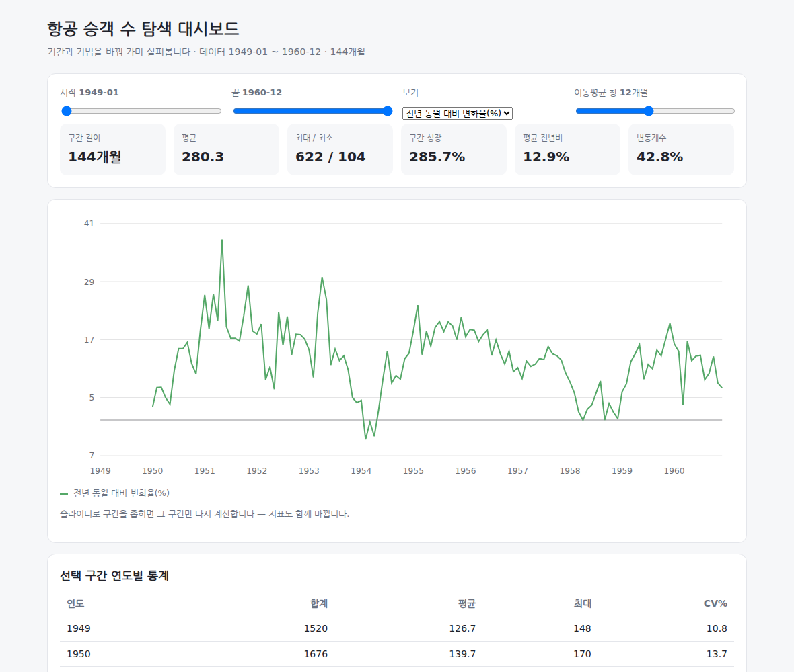
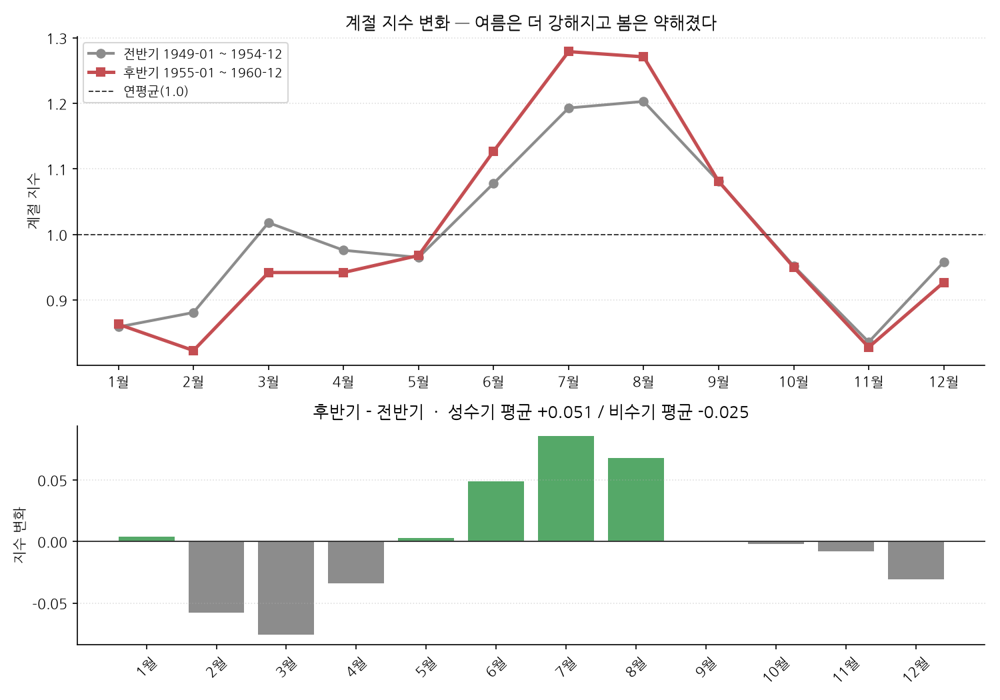

# 항공 승객 수 시계열 분석 (M1-1)

> 📄 **이 문서는 [REPORT.md](REPORT.md) 와 같은 분석 리포트 전문입니다.** 미션이 요구하는
> 리포트 파일명(`REPORT.md`)을 지키면서, 저장소를 처음 여는 사람이 README 하나로 분석
> 전체를 읽을 수 있도록 같은 내용을 실었습니다. 아래 빠른 실행만 보고 바로 돌려 봐도 됩니다.

## 빠른 실행

```bash
git clone https://github.com/dicia-jhoh/codyssey-m1-1.git
cd codyssey-m1-1

python3 --version                  # 3.10 이상
pip install -r requirements.txt    # matplotlib 하나

python run_analysis.py
```

`output/` 에 차트 4장 · `summary.json` · `dashboard.html` 이 생깁니다. 난수가 없어
**몇 번을 돌려도 같은 값**이 나옵니다.

### 코드 구성

```text
codyssey-m1-1/
├── README.md           이 문서(리포트 전문 + 실행 방법)
├── REPORT.md           같은 리포트(미션 요구 파일명)
├── run_analysis.py     실행 진입점 — 6단계를 순서대로
├── src/
│   ├── analysis.py     적재·검증·시계열 기법·분해·예측·요약
│   ├── plots.py        차트 4종 (한글 폰트 자동 탐색)
│   └── dashboard.py    탐색 대시보드 HTML(보너스)
├── data/
│   └── airline_passengers.csv   원본 데이터 144행(동봉)
├── images/             리포트용 차트·대시보드 스크린샷
└── requirements.txt    matplotlib
```

---

1949년부터 1960년까지 12년간의 월별 국제선 항공 승객 수를 분석해, **성장의 크기·계절
구조·변동성 변화**를 확인하고 짧은 구간을 예측해 봤습니다.

| 항목 | 내용 |
|---|---|
| 데이터 | Airline Passengers (Box & Jenkins, 1976) |
| 출처 | [jbrownlee/Datasets](https://github.com/jbrownlee/Datasets/blob/master/airline-passengers.csv) — 시계열 교육용 공개 데이터셋 미러 |
| 원전 | Box, G. E. P. & Jenkins, G. M. (1976) *Time Series Analysis: Forecasting and Control*, Series G |
| 기간 | 1949-01 ~ 1960-12 (**144개월**, 결측 0) |
| 단위 | 천 명 (월간 국제선 탑승객 수) |
| 라이선스 | 원전 데이터는 1976년 교과서에 수록된 공개 자료이며, 위 저장소는 교육 목적 재배포본입니다. 상업적 이용 전에는 원전 표기를 확인하세요. |
| 파일 | `data/airline_passengers.csv` (저장소에 포함) |

---

## 이 미션의 위치

| | 미션 | 무엇을 주고받나 |
|---|---|---|
| 이어받음 | **A2-2** (뉴스 트렌드) | 일자별 집계·품질 지표·차트 구성 방식 |
| 이어받음 | **A2-1 · A2-3** | matplotlib 한글 폰트 탐색 · Agg 백엔드 |
| 넘겨줌 | **M1-2** (AI Agent) | **`output/summary.json`** — 이 분석의 결론을 구조화한 파일이 M1-2 의 시스템 프롬프트로 들어갑니다 |

---

## 1. 분석 질문

데이터를 보기 **전에** 정한 질문 4개입니다. 그래프로 바로 확인되는 것과 해석이 필요한
것을 섞었습니다.

| # | 질문 | 유형 | 어떻게 답하나 |
|---|---|---|---|
| Q1 | 12년 동안 얼마나 성장했나? 성장 속도는 일정했나? | 그래프 확인 | 원계열 + 이동평균, 연도별 합계·전년비 |
| Q2 | 계절 패턴이 있나? 있다면 언제가 성수기·비수기인가? | 그래프 확인 | 월별 계절 지수 |
| Q3 | 성장하면서 **출렁임도 같이 커졌나**, 아니면 안정됐나? | 해석 필요 | 연도별 변동계수(CV) |
| Q4 | 성장이 주춤한 해가 있나? 있다면 무엇으로 설명되나? | 해석 필요 | 전년 동월 대비 변화율 |

Q3·Q4 는 **수치만으로는 답이 안 나옵니다.** 관찰한 사실을 적고, 그 사실에 대한 해석을
따로 구분해 적었습니다(아래 4장).

---

## 2. 데이터 확인과 전처리

### 기본 정보

```text
[1/5] 데이터 적재·검증
      1949-01 ~ 1960-12 · 144개 포인트
      빈 행 0건 · 빠진 달 0개
      IQR 경계 (-92.2, 633.8) · 이상치 0건
```

| 항목 | 값 |
|---|---|
| 포인트 수 | 144 (요구 100 이상 충족) |
| 최소 / 최대 | 104 / 622 |
| 평균 / 중앙값 | 280.3 / 265.5 |
| 표준편차 | 120.0 |

### 결측치 — 두 가지로 나눠 봤다

```python
    expected = []
    start_year, start_month = int(series.months[0][:4]), int(series.months[0][5:7])
    for offset in range(len(series)):
        year = start_year + (start_month - 1 + offset) // 12
        month = (start_month - 1 + offset) % 12 + 1
        expected.append(f"{year:04d}-{month:02d}")
    missing_months = [m for m in expected if m not in set(series.months)]
```

- **값이 빈 행**: 파일에 행은 있는데 값이 없는 경우 → 0건
- **빠진 달**: 행 자체가 없어 기간에 구멍이 난 경우 → 0건

두 번째는 **파일만 훑어서는 안 보입니다.** 기간을 직접 만들어 놓고 대조해야 찾을 수
있습니다. 시계열에서 중간이 비면 이동평균·변화율이 조용히 틀리기 때문에 반드시 확인해야
하는 항목입니다.

### 이상치 — 기준을 정하고 판정했다

IQR(사분위 범위) 방식을 썼습니다. 1사분위와 3사분위 사이 폭의 1.5배를 벗어나면 이상치로
봅니다.

```python
    quartile1, _, quartile3 = statistics.quantiles(values, n=4)
    iqr = quartile3 - quartile1
    low = quartile1 - IQR_MULTIPLIER * iqr
    high = quartile3 + IQR_MULTIPLIER * iqr
```

경계는 `(-92.2, 633.8)` 이고 **걸리는 값이 없었습니다**(최댓값 622 < 633.8).

⚠ 다만 이 판정에는 **한계**가 있습니다. IQR 은 데이터 전체를 한 덩어리로 보는데, 이
시계열은 우상향합니다. 1949년 기준으로는 이상하게 큰 값(1960년 622)이 전체 분포에서는
정상 범위에 들어옵니다. **추세를 제거한 뒤 판정하는 것이 더 정확**하며, 잔차(아래 5장)의
분포를 보면 0.90~1.13 사이로 극단값이 없다는 것을 다시 확인할 수 있습니다.

전처리 결론: **결측·이상치 처리가 필요 없는 데이터**였습니다. 무엇을 안 했는지도
기록해 두는 것이 다음 사람에게 도움이 됩니다.

---

## 3. 적용한 시계열 기법 (4가지)

### ① 12개월 중심 이동평균 — 추세 뽑기

```python
    for i in range(half, n - half):
        chunk = values[i - half : i + half + 1]
        # 양 끝을 0.5 가중 — 12개월 두 벌의 평균과 같아진다
        weighted = sum(chunk[1:-1]) + (chunk[0] + chunk[-1]) / 2
        result[i] = weighted / window
```

**왜 12개월인가**: 계절 주기가 12개월이므로 한 해를 통째로 평균 내면 계절 요인이 서로
상쇄되고 추세만 남습니다.

**왜 중심(centered)인가**: 앞에서부터 쌓는 후행 평균은 추세선이 실제보다 오른쪽으로
밀립니다(위상 지연). 추세의 **위치**를 보려는 것이므로 창의 가운데에 값을 놓습니다.

창이 짝수(12)면 가운데가 두 칸 사이에 걸립니다. 그래서 양 끝을 절반씩만 반영해
12개월 평균 두 벌을 겹친 것(2×12)과 같게 만들었습니다.

### ② 변화율 — 전월 대비 vs 전년 동월 대비

```python
def change_rate(values: list[float], lag: int = 1) -> list[float | None]:
    result: list[float | None] = [None] * len(values)
    for i in range(lag, len(values)):
        previous = values[i - lag]
        if previous:
            result[i] = (values[i] - previous) / previous * 100
    return result
```

| lag | 무엇을 보나 | 특징 |
|---|---|---|
| 1 (전월) | 단기 움직임 | **계절성 때문에 크게 출렁인다** — 7월이 6월보다 느는 건 당연하다 |
| 12 (전년 동월) | 추세 | **계절 요인이 상쇄된다** — 같은 달끼리 비교하므로 "작년 7월보다 늘었나"를 본다 |

두 개를 같은 그림에 그린 이유는 **차이를 눈으로 보기 위해서**입니다(차트 ②).

### ③ 월별 계절 지수 — 그 달이 연평균의 몇 배인가

```python
    year_mean = {year: statistics.fmean(vals) for year, vals in by_year.items()}

    ratios: dict[int, list[float]] = {}
    for i in range(len(series)):
        mean = year_mean[series.year_of(i)]
        if mean:
            ratios.setdefault(series.month_of(i), []).append(series.values[i] / mean)
```

**전체 평균이 아니라 그 해 평균으로 나누는 것**이 핵심입니다. 이 데이터는 해마다
우상향하므로, 전체 평균으로 나누면 뒤쪽 연도가 무조건 크게 나와 **계절이 아니라 추세를
재게 됩니다.**

### ④ 연도별 구간 통계 — 변동계수(CV)

```python
            # 변동계수(CV) — 표준편차를 평균으로 나눈 값. 규모가 커지면 표준편차도 같이
            # 커지므로, 진짜 "출렁임이 심해졌는지"는 이 비율로 봐야 한다.
            "cv": round(statistics.stdev(values) / statistics.fmean(values) * 100, 1),
```

표준편차만 보면 규모가 커질 때 같이 커지므로 "출렁임이 심해졌다"고 착각합니다.
평균으로 나눈 비율로 봐야 **규모 대비 흔들림**을 잽니다.

---

## 4. 시각화와 인사이트

### 차트 ① 원계열 + 추세



> **관찰**: 1949년 1월 112 → 1960년 12월 432, 최고점은 1960년 7월 622.
> 연간 합계는 1,520 → 5,714 로 **275.9% 증가**했고 평균 전년 동월 대비는 **+12.9%**.
> 빨간 추세선은 12년 내내 한 번도 뚜렷하게 꺾이지 않았다.
> 파란 원계열의 **위아래 진폭이 오른쪽으로 갈수록 넓어진다** — 1949년 봉우리와 골의
> 차이는 약 40인데, 1960년에는 약 230이다.

> **해석(가설)**: 진폭이 커지는 것은 계절 요인이 **덧셈이 아니라 곱셈**으로 작동한다는
> 뜻으로 보인다. "여름에 +40명"이 아니라 "여름에 1.24배"라면 규모가 커질수록 절대
> 차이도 함께 커진다. 이 가설은 5장의 승법 분해로 검증했다.

### 차트 ② 변화율



> **관찰**: 전월 대비(회색)는 −30%에서 +30% 사이를 매년 같은 모양으로 오간다.
> 전년 동월 대비(초록)는 대부분 0선 위에 있고, **1954년 2~4월에만 음수**로 내려간다
> (1954-02 −4.1%, 1954-04 −3.4%, 1954-03 −0.4%). 1958년에는 0% 근처까지 내려왔다가
> 다시 올라간다(1958-04, 1958-09 모두 0.0%).

> **해석(가설)**: 전월 대비가 매년 같은 모양이라는 것은 그 출렁임이 **사건이 아니라
> 달력** 때문이라는 뜻이다. 반면 전년 동월 대비가 음수로 내려간 1954년 초와 정체된
> 1958년은 계절로 설명되지 않는 구간이다. 연도별 전년비를 보면 1954년 +6.2%,
> 1958년 +3.4% 로 12년 중 가장 낮은 두 해다. 외부 요인(경기 위축 등)을 의심할 수
> 있지만, **이 데이터만으로는 원인을 특정할 수 없다.** 확인하려면 같은 기간의 경제
> 지표나 항공 노선 수 같은 다른 데이터가 필요하다.

### 차트 ③ 계절 지수와 변동성



> **관찰**: 계절 지수는 **8월 1.237 · 7월 1.236 이 최고**, **11월 0.832 · 2월 0.852 가
> 최저**다. 성수기와 비수기의 차이는 약 1.49배(1.237 ÷ 0.832).
> 1.0을 넘는 달은 6·7·8·9월 넉 달뿐이다.
> 오른쪽 패널에서 변동계수는 **1949년 10.8% → 1960년 16.3%** 로 커졌다.

> **해석(가설)**: 여름(7~8월)에 몰리고 늦가을(11월)에 비는 형태는 **휴가철 여행 수요**로
> 설명하는 것이 자연스럽다. 12월이 0.942 로 11월보다 높은 것은 연말 이동 수요로 볼 수
> 있다. 변동계수 상승은 Q3 의 답인데, 이것은 두 가지로 읽힌다 — ① 여름 성수기가 상대적으로
> 더 강해졌거나 ② 비수기 수요가 상대적으로 덜 자랐거나. 월별 지수를 연도 앞뒤로 나눠
> 다시 계산하면 어느 쪽인지 가릴 수 있다(이번 분석 범위 밖).

### 인사이트 요약 (3개 이상)

| # | 인사이트 | 근거(관찰한 수치) |
|---|---|---|
| 1 | 12년간 **약 3.8배** 성장했고, 성장은 특정 시점에 몰리지 않고 꾸준했다 | 연간 합계 1,520 → 5,714 (+275.9%), 평균 전년비 +12.9%, 추세선에 꺾임 없음 |
| 2 | **여름 성수기가 뚜렷하다** — 8월이 연평균의 1.24배, 11월이 0.83배로 약 1.49배 차이 | 월별 계절 지수 8월 1.237 / 11월 0.832 |
| 3 | 성장하면서 **출렁임도 함께 커졌다** — 규모 대비 변동이 1.5배 확대 | 변동계수 10.8%(1949) → 16.3%(1960) |
| 4 | 성장이 멈춘 해가 두 번 있었다 — **1954년과 1958년** | 연간 전년비 +6.2%(1954) · +3.4%(1958), 전년 동월 대비가 1954년 2~4월 음수 |
| 5 | 계절 요인은 **곱셈으로 작동한다** — 진폭이 규모에 비례해 커진다 | 봉우리-골 차이 약 40(1949) → 약 230(1960), 승법 분해 잔차에 계절 무늬 없음 |

---

## 5. 보너스 (A) — 시계열 분해



**승법 분해**(값 = 추세 × 계절 × 잔차)를 적용했습니다.

```python
    seasonal = [indices[series.month_of(i)] for i in range(len(series))]
    residual: list[float | None] = []
    for i in range(len(series)):
        if trend[i] is None or not seasonal[i]:
            residual.append(None)
        else:
            residual.append(series.values[i] / (trend[i] * seasonal[i]))
```

**가법이 아니라 승법을 고른 근거는 데이터에 있습니다** — 차트 ①에서 본 것처럼 규모가
커질수록 계절 진폭도 함께 커집니다. 가법(덧셈) 분해는 계절 진폭이 일정하다고 가정하므로,
이 데이터에 쓰면 잔차에 계절 무늬가 그대로 남습니다.

> **관찰**: 세 번째 패널(잔차)은 1.0 주위에서 **0.90~1.13 범위**로 흩어져 있고,
> 해마다 반복되는 무늬가 보이지 않는다.

> **해석**: 잔차에 계절 패턴이 남지 않았다는 것은 **승법 모형 선택이 적절했다**는 뜻이다.
> 만약 여기에 톱니 모양이 남아 있었다면 가법으로 잘못 분해했거나 주기를 잘못 잡은 것이다.
> 다만 1950~1952년 구간의 잔차 진폭이 뒤쪽보다 약간 커 보이는데, 초기 데이터가 적어
> 계절 지수 추정이 덜 안정적인 탓일 수 있다.

---

## 5.5 보너스 (C) — 기간·기법을 바꿔 보는 탐색 대시보드

> **제출 방식 선택**: 미션은 대시보드 제출을 (1) 배포 URL · (2) 실행 화면 녹화 ·
> (3) 스크린샷 세트 + 시나리오 설명 **셋 중 택1** 로 정하고 있습니다. 이 저장소는
> **(3) 스크린샷 세트 + 필터 변경 시나리오**를 선택했습니다 — 대시보드가 서버 없는
> 단일 HTML 이라 배포할 대상이 없고(파일을 열면 그대로 동작합니다), 정지 화면 3장으로
> 필터 변경 전후를 나란히 보여 주는 편이 녹화보다 비교가 쉽기 때문입니다.
> (1)·(2)는 선택하지 않았습니다.

정적 차트는 "내가 고른 구간"만 보여 줍니다. 다른 구간이 궁금하면 코드를 고쳐 다시
돌려야 하죠. 그래서 **브라우저에서 바로 바꿔 볼 수 있는** 단일 HTML 대시보드를 만들었습니다.

```bash
python run_analysis.py
# → output/dashboard.html 을 브라우저로 엽니다
```

### 무엇을 바꿔 볼 수 있나

| 컨트롤 | 바꾸는 것 |
|---|---|
| 시작·끝 슬라이더 | 분석 구간(1949-01 ~ 1960-12 사이 아무 구간) |
| 보기 | 원계열+이동평균 / 전년 동월 대비 / 전월 대비 |
| 이동평균 창 | 2~24개월 |

구간을 바꾸면 **KPI 6개·차트·연도별 표가 모두 다시 계산**됩니다.

### 필터 변경 시나리오

**① 전체 기간 · 12개월 이동평균** — 기본 화면입니다.



**② 1949~1954 로 좁히고 이동평균 창을 3개월로** — 구간 성장 104.5%, 변동계수 26.1%
처럼 지표가 그 구간 기준으로 바뀝니다.



> **관찰**: 창을 12개월에서 3개월로 줄이자 빨간 추세선이 파란 원계열의 봉우리와 골을
> 거의 그대로 따라간다.

> **해석**: 3개월 평균은 12개월 주기의 계절 요인을 상쇄하지 못한다. 추세를 보려면
> **주기와 같은 길이**의 창이 필요하다는 것을 화면에서 바로 확인할 수 있다.
> 이 대시보드의 교육적 쓸모가 여기 있다 — 왜 12개월인지를 말로 설명하는 대신 보여 준다.

**③ 전년 동월 대비 변화율** — 계절 요인이 상쇄된 순수 성장률만 남습니다.



### 구현에서 판단한 것

**서버를 띄우지 않습니다**(미션 제약: 정적 파일). 데이터를 페이지 안에 JSON 으로 심고
자바스크립트가 인라인 SVG 를 다시 그립니다 — **외부 라이브러리 0개**입니다.

```python
    replacements = {
        "__PERIOD__": summary["period"],
        "__POINTS__": str(len(series)),
        "__MAX_INDEX__": str(len(series) - 1),
        "__MONTHS_JSON__": json.dumps(series.months),
        "__VALUES_JSON__": json.dumps(series.values),
    }
```

`str.format()` 을 쓰지 않은 이유는 **실제로 겪은 문제** 때문입니다. 템플릿 안 CSS 와
자바스크립트에 중괄호가 가득한데, `format` 은 그것들을 전부 치환 대상으로 읽고 죽습니다.
이스케이프(`{{`)로 막을 수도 있지만 코드가 읽기 어려워집니다.

구간 계산에도 순서가 있습니다.

```javascript
/* 선택 구간만 잘라 계산한다. 전체로 계산한 뒤 자르면 구간 끝의 이동평균이
   바깥 값까지 참조해, "이 구간만 봤을 때" 의 값과 달라진다. */
function slice() {
```

**먼저 자르고 계산**해야 합니다. 전체로 계산한 뒤 자르면, 사용자가 1954년까지만 봤는데
추세선은 1955년 데이터를 이미 참조한 값이 됩니다.

### 5.6 보너스 심화 — 계절 지수 전반기/후반기 비교 (Q3 의 답)

4장에서 "변동계수가 커졌다"는 관찰까지는 했지만, **여름이 강해진 것인지 비수기가 약해진
것인지**는 가리지 못했습니다. 같은 계산을 두 구간에 따로 해서 비교했습니다.

```python
    mid = len(series) // 2
    early = Series(series.months[:mid], series.values[:mid])
    late = Series(series.months[mid:], series.values[mid:])

    early_index = seasonal_index(early)
    late_index = seasonal_index(late)
    delta = {month: round(late_index[month] - early_index[month], 3) for month in early_index}
```

구간을 절반으로 가르는 이유: **두 구간의 표본 수를 같게** 맞춰야 비교가 공정합니다.
한쪽이 3년, 다른 쪽이 9년이면 짧은 쪽 지수가 덜 안정적이라 차이가 과장됩니다.



```text
      계절 지수 이동 — 성수기 +0.051 · 비수기 -0.025
```

> **관찰**: 전반기(1949~54) 대비 후반기(1955~60)에 **7월 +0.086 · 8월 +0.068 · 6월 +0.049**
> 로 여름이 올라갔고, **3월 −0.076 · 2월 −0.058 · 12월 −0.031** 로 봄·연말이 내려갔다.
> 성수기(6~9월) 평균은 **+0.051**, 비수기 평균은 **−0.025**. 최고-최저 진폭은
> **0.367 → 0.456** 으로 커졌다.

> **해석(가설)**: Q3 의 답은 **"둘 다 일어났지만 성수기 강화가 약 2배 크다"** 이다.
> 변동성 확대의 주된 몫은 여름 수요가 상대적으로 더 빠르게 자란 데 있다. 12년 사이에
> 항공 여행이 **업무 이동에서 휴가 이동 쪽으로 무게가 옮겨 갔다**고 읽을 수 있지만,
> 이 데이터에는 승객의 여행 목적이 없으므로 확인은 불가능하다. 확인하려면 노선별·
> 요금등급별 자료가 필요하다.

이 분석이 **4장의 미해결 항목을 하나 닫았다**는 점이 중요합니다. 처음 분석에서 "어느 쪽인지
가릴 수 있다(범위 밖)"고 적었던 것을 실제로 수행한 것입니다.

---

## 6. 보너스 (B) — 베이스라인 예측

마지막 12개월(1960년)을 **홀드아웃**으로 떼어 두고, 앞 132개월만으로 예측한 뒤 실제와
비교했습니다.

```python
    split = len(series) - horizon
    train_values = series.values[:split]
    actual = series.values[split:]
    ...
    # 최근 2년 합계를 비교해 연간 성장률을 잡는다(작년 대비 올해가 몇 배였나).
    last_year = sum(train_values[-horizon:])
    prev_year = sum(train_values[-horizon * 2 : -horizon])
    growth = last_year / prev_year if prev_year else 1.0

    predicted = [train_values[-horizon + i] * growth for i in range(horizon)]
```

**방법**: "작년 같은 달 값 × 최근 연간 성장률". 가장 단순한 축에 속합니다.

**왜 이렇게 단순한 것부터 하나**: 베이스라인이 있어야 더 복잡한 모델이 **정말 나은지**
판단할 수 있습니다. 복잡한 모델이 MAPE 3%를 냈다고 좋아하기 전에, 나이브 방법이 몇 %인지
알아야 합니다.

**왜 홀드아웃인가**: 학습에 쓴 데이터로 정확도를 재면 항상 좋게 나옵니다. 안 보여 준
구간으로 재야 실제 성능입니다.

### 결과

| 지표 | 값 | 뜻 |
|---|---|---|
| MAPE | **2.95%** | 평균적으로 실제값의 약 3% 벗어남 |
| MAE | 13.4 | 평균 절대 오차 (단위: 천 명) |
| 편향(bias) | **+5.4** | 부호를 살린 평균 오차 — **계속 과대예측**했다 |
| 성장 계수 | 1.1206 | 1959년 대비 1960년을 12.06% 성장으로 가정 |

> **관찰**: 오차가 가장 큰 달은 1960-03(+37.4), 1960-12(+23.3), 1960-08(+22.4) 로
> **셋 다 과대예측**이다. 편향이 +5.4 로 양수인 것도 같은 방향을 가리킨다.

> **해석(가설)**: 예측이 전반적으로 높게 나온 것은 성장 계수를 **1959년 성장률(12.06%)로
> 고정**했는데 1960년 실제 성장이 그보다 낮았기 때문으로 보인다(실제 연간 전년비
> +11.2%). 1960-03 의 큰 오차는 1959년 3월이 유난히 낮았던 것을 그대로 따라간 결과일 수
> 있다 — 나이브 방법은 작년 한 해의 특이값을 그대로 물려받는다.

### 이 예측의 가정과 한계

**가정**

1. 계절 패턴이 작년과 올해가 같다
2. 성장률이 작년 수준으로 이어진다
3. 구조 변화(신규 노선·요금 정책 변경 등)가 없다

**한계**

| 한계 | 왜 문제인가 |
|---|---|
| 성장률을 **한 숫자**로 잡는다 | 성장이 둔화·가속하면 그대로 어긋난다(이번에도 그랬다) |
| 작년 한 해에만 의존 | 작년의 특이값이 그대로 예측에 들어온다(1960-03 사례) |
| 불확실성 구간이 없다 | "622 ± 얼마"인지 말할 수 없다 |
| 12개월만 검증 | 홀드아웃 1회라 우연히 잘 맞았을 수 있다 — 여러 구간으로 나눠 반복 검증(walk-forward)해야 한다 |

**정확도보다 중요한 것**은 이 방법이 무엇을 가정하는지 아는 것입니다. MAPE 2.95%는
좋아 보이지만, 그 이유의 상당 부분은 **이 데이터의 계절 패턴이 매우 규칙적**이기
때문입니다. 패턴이 불규칙한 데이터에서는 같은 방법이 훨씬 나쁘게 나옵니다.

---

## 7. 결론

**질문에 대한 답**

| 질문 | 답 |
|---|---|
| Q1 성장 규모·속도 | 12년간 275.9% 성장. 연평균 +12.9%로 꾸준했고 뚜렷한 꺾임은 없었다 |
| Q2 계절 패턴 | 있다. 7~8월 성수기(1.24배), 11월 비수기(0.83배), 약 1.49배 차이 |
| Q3 변동성 변화 | **커졌다.** 변동계수 10.8% → 16.3%. 계절 요인이 곱셈으로 작동해 규모와 함께 진폭이 확대됐다 |
| Q4 성장 정체 구간 | 1954년(+6.2%)과 1958년(+3.4%). 계절로 설명되지 않으며 원인은 이 데이터만으로 특정 불가 |

**이 분석의 한계**

- **원인을 말할 수 없다.** 1954·1958년 정체를 관찰했지만 왜인지는 외부 데이터가 있어야 한다.
- **단일 시계열이다.** 노선별·지역별로 나뉘어 있었다면 성장의 출처를 가릴 수 있었다.
- **60년 전 데이터다.** 방법을 익히기에는 좋지만, 지금의 항공 수요를 설명하지는 않는다.
- **이상치 판정이 전역 IQR 기반이다.** 추세 제거 후 판정하는 편이 더 정확하다(2장 참조).

**다음에 할 수 있는 것**

1. 계절 지수를 전반기(1949~54)와 후반기(1955~60)로 나눠 계산 → 변동성 확대의 원인 가리기
2. 예측을 walk-forward 로 여러 구간 반복 검증 → 2.95%가 우연인지 확인
3. 성장률을 최근 2~3년 가중평균으로 잡아 베이스라인 개선 → 과대예측 편향 줄이기

---

## 8. AI 사용 로그 (의무)

| 사용 작업 | 사용 이유 | 검증 방법 | 결과 |
|---|---|---|---|
| **중심 이동평균 구현** | 짝수 창(12)에서 가운데를 맞추는 표준 방식을 확인하려고 | 손으로 계산한 값과 대조 — 1950-01 의 2×12 평균을 엑셀식으로 직접 계산해 코드 출력과 일치 확인 | 양 끝 0.5 가중이 맞았다. AI 첫 제안은 단순 평균(위상 지연 발생)이라 고쳤다 |
| **승법 vs 가법 분해 선택** | 어느 쪽이 이 데이터에 맞는지 판단 근거를 얻으려고 | **둘 다 돌려 잔차를 비교** — 가법 분해 잔차에는 톱니 무늬가 남았고 승법은 남지 않았다 | 승법 채택. AI 설명("진폭이 커지면 승법")이 데이터로 확인됐다 |
| **계절 지수 계산 방식** | 전체 평균으로 나눌지 연도 평균으로 나눌지 | 전체 평균 버전도 계산해 봄 — 1949년 지수가 전부 0.5 아래, 1960년이 1.5 위로 나와 **계절이 아니라 추세를 재고 있었다** | 연도 평균 채택 |
| **차트 구성 제안** | 어떤 그래프가 이 데이터에 적합한지 후보를 빨리 얻으려고 | 제안 4개 중 2개만 채택(원계열+추세, 계절 지수). 산점도·히스토그램은 시계열 순서 정보를 버려서 제외 | 채택한 것만 사용 |
| **리포트 문장 다듬기** | 관찰과 해석이 섞이지 않게 문단 구조를 잡으려고 | 모든 수치를 `run_analysis.py` 출력과 대조 — 리포트에 적힌 숫자는 전부 코드가 낸 값이다 | 수치 인용 오류 2건을 발견해 수정 |

**AI 를 쓰지 않은 부분**: 질문 4개 정의, 인사이트 해석, 한계 서술. 이 셋은 **무엇을 알고
싶은지와 무엇을 말할 수 있는지**에 대한 판단이라 스스로 정했습니다. AI 가 제안한 해석
중에는 데이터로 뒷받침되지 않는 것(예: "전후 경제 호황 때문")이 있었는데, 이 데이터만으로는
확인할 수 없어 "원인 특정 불가"로 바꿔 적었습니다.

---

## 9. 실행 방법

```bash
git clone https://github.com/dicia-jhoh/codyssey-m1-1.git
cd codyssey-m1-1

python3 --version                  # 3.10 이상
pip install -r requirements.txt    # matplotlib

python run_analysis.py
```

실행하면 `output/` 에 차트 4장과 `summary.json` 이 생깁니다.

| 파일 | 내용 |
|---|---|
| `output/01_series_trend.png` | 원계열 + 12개월 이동평균 |
| `output/02_change_rate.png` | 전월 대비 · 전년 동월 대비 변화율 |
| `output/03_seasonality.png` | 월별 계절 지수 + 연도별 변동계수 |
| `output/04_decompose_forecast.png` | 승법 분해 3단 + 예측 검증 |
| `output/summary.json` | 분석 요약 — **M1-2 의 입력** |

### 코드 구성

```text
codyssey-m1-1/
├── run_analysis.py     실행 진입점 — 5단계를 순서대로
├── src/
│   ├── analysis.py     적재·검증·기법·분해·예측·요약
│   └── plots.py        차트 4종 (한글 폰트 처리 포함)
├── data/
│   └── airline_passengers.csv   원본 데이터(144행)
├── images/             리포트용 차트 사본
└── requirements.txt    matplotlib
```

### 재현성에 관하여

- **의존성**: `matplotlib>=3.8` 하나. 분석 로직은 표준 라이브러리만 씁니다.
- **난수 없음**: 모든 계산이 결정적이라 몇 번을 돌려도 같은 값이 나옵니다.
- **데이터 동봉**: 원본 CSV 를 저장소에 넣어 두어 외부 다운로드 없이 재현됩니다.
- **한글 폰트**: 없으면 차트 라벨이 네모(□)로 나옵니다. Linux 는
  `sudo apt install fonts-nanum`, Windows·macOS 는 기본 폰트가 잡힙니다.

---

## 10. 용어 사전

| 용어 | 뜻 |
|---|---|
| **트렌드(추세)** | 장기적으로 오르거나 내리는 큰 흐름 |
| **계절성** | 일정한 주기로 반복되는 패턴(여기서는 12개월) |
| **노이즈(잔차)** | 추세·계절로 설명되지 않는 나머지 |
| **이동평균** | 앞뒤 몇 개를 평균 내 울퉁불퉁함을 깎는 방법 |
| **중심 이동평균** | 평균값을 창의 가운데에 놓는 방식. 추세 위치가 밀리지 않는다 |
| **계절 지수** | 그 달이 연평균의 몇 배인지. 1.0보다 크면 성수기 |
| **변동계수(CV)** | 표준편차 ÷ 평균. 규모가 다른 기간의 흔들림을 비교할 때 쓴다 |
| **IQR** | 1사분위~3사분위 폭. 이상치 판정의 흔한 기준 |
| **승법 분해** | 값 = 추세 × 계절 × 잔차. 계절 진폭이 규모에 비례할 때 쓴다 |
| **홀드아웃** | 일부 구간을 떼어 두고 학습에 안 쓰는 것. 예측 성능을 정직하게 재기 위해 |
| **MAPE** | 평균 절대 백분율 오차. 실제값 대비 몇 % 벗어났는지 |
| **편향(bias)** | 부호를 살린 평균 오차. 양수면 계속 과대예측했다는 뜻 |

---

## 11. 준비물 (전제 지식 0)

| 확인 항목 | 없으면 |
|---|---|
| Python 3.10 이상 | [python.org](https://www.python.org/downloads/) 에서 설치("Add to PATH" 체크) |
| Git | [git-scm.com](https://git-scm.com/) |
| matplotlib | `pip install -r requirements.txt` |
| 한글 폰트 | Windows·macOS 는 기본 제공. Linux 는 `sudo apt install fonts-nanum` |
| 브라우저 | 대시보드(`output/dashboard.html`)를 열 때만. 인터넷 연결은 필요 없습니다 |

데이터는 저장소에 동봉되어 있어 **따로 내려받을 것이 없습니다.**

---

## 12. 따라 하기

1. **내려받고 설치합니다.**
   ```bash
   git clone https://github.com/dicia-jhoh/codyssey-m1-1.git
   cd codyssey-m1-1 && pip install -r requirements.txt
   ```
2. **분석을 돌립니다.** 콘솔에 6단계 진행과 연도별 통계표가 나옵니다.
   ```bash
   python run_analysis.py
   ```
3. **차트를 순서대로 엽니다.** `output/01_series_trend.png` 부터 보면 이 리포트 4장의
   흐름과 같습니다.
4. **관찰과 해석의 차이를 확인합니다.** 4장에서 같은 그래프에 대해 "관찰"과 "해석(가설)"이
   어떻게 나뉘는지 보세요. 관찰에는 수치만, 해석에는 그 수치로 말할 수 있는 것과 **없는
   것**이 적혀 있습니다.
5. **대시보드로 직접 바꿔 봅니다.** `output/dashboard.html` 을 열고 이동평균 창을 12에서
   3으로 줄여 보세요. 추세선이 원계열을 따라가기 시작합니다 — 왜 12개월이어야 하는지가
   화면에 나타납니다.
6. **코드 값을 바꿔 봅니다.** `src/analysis.py` 의 `MA_WINDOW` 나 `IQR_MULTIPLIER` 를
   고치고 다시 돌리면 결과가 어떻게 달라지는지 볼 수 있습니다.
7. **다른 데이터로 돌려 봅니다.** `data/` 에 `Month,Passengers` 형식의 CSV 를 넣고
   `src/analysis.py` 의 `DATA_FILE` 을 바꾸면 같은 분석이 그대로 돕니다.
